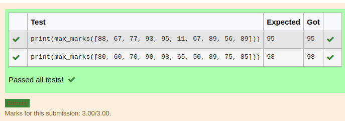
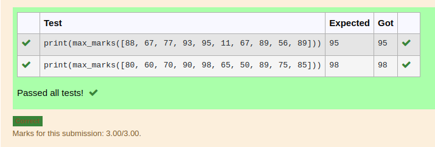
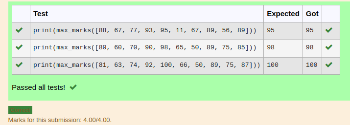

# Find the maximum of a list of numbers
## Aim:
To write a program to find the maximum of a list of numbers.
## Equipment’s required:
1.	Hardware – PCs
2.	Anaconda – Python 3.7 Installation / Moodle-Code Runner
## Algorithm:
1.	Get the list of marks as input
2.	Use the sort() function or max() function or use the for loop to find the maximum mark.
3.	Return the maximum value
## Program:
```python
''' 
Program to mark the maximum of marks using the list method sort
Developed by: your name: jegadeesh
RegisterNumber: 22004355
'''
def max_marks(marks):
    marks.sort()
    return marks[-1]
    
```
```python
''' 
Program to find the maximum marks using the list method max().
Developed by:jegadeesh
RegisterNumber: 22004355
'''
def max_marks(marks):
    large =max(marks)
    return large
```
```python
''' 
Program to the maximum marks without using builtin functions.
Developed by:jegadeesh
RegisterNumber: 22004355
'''
def max_marks(list1):
    max1 = list1[0]
    for i in list1:
        if i >= max1:
            max1 = i
    return max1
        
```


## Output:




## Result:
Thus the program to find the maximum of given numbers from the list is written and verified using python programming.